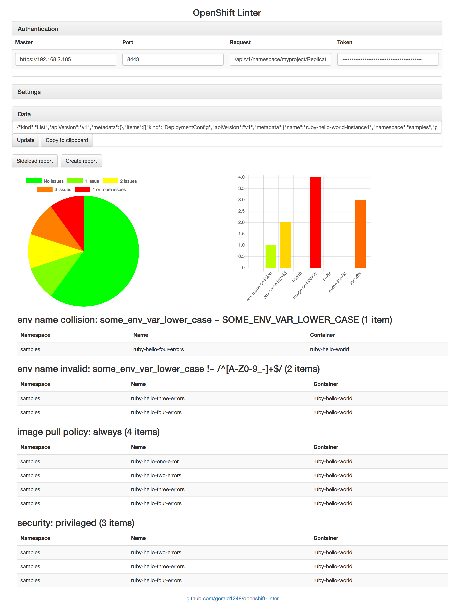

OpenShift Linter
================

This is a utility for OpenShift users/admins who want to know if certain rules have been followed.



**Fig. 1** OpenShift Linter GUI

Usage
-----
```
Usage: ./openshift-linter [<JSON/YAML file> [<JSON/YAML file>]]
  -c string
    	TLS server certificate (default "cert.pem")
  -k string
      TLS server key (default "key.pem")
  -n string
      hostname (default "localhost")
  -o string
      output format (json, yaml or md) (default "md")
  -p int
      listen on port (default 8443)
  --container string
    	pattern for containers (default "^[a-z0-9_-]+$")
  --env string
    	pattern for environment variables (default "^[A-Z0-9_-]+$")
  --name string
    	pattern for names (default "^[a-z0-9_-]+$")
  --namespace string
    	pattern for namespaces/projects (default "^[a-z0-9_-]*$")
  --namespace-label string
    	metadata.labels key denoting namespace (default "env")
  --skip-container string
    	pattern for skipped containers
  --whitelist-registries string
    	pattern for whitelisted registries (default ".*")
Commands:
  list	Print list of available checks
```

The main use cases are:

* Command line: this use case assumes you already have a bunch of configuration objects (e.g. the output of `oc export dc --all-namespaces --raw`)
* Server: you wish to generate reports by posting JSON configuration files to the server at the URL shown
* GUI: point your browser to the URL shown and fetch current configuration data from the master

### Command line use
```
$ ./openshift-linter i-contain-multitudes.yaml
```

On the command line, the sample configuration `data/sample-mix.min.json` produces the following markdown output (excerpt):

```markdown
image pull policy
-----------------

### always

|**Namespace**|**Name**               |**Container**   |
|:------------|:----------------------|:---------------|
|samples      |ruby-hello-one-error   |ruby-hello-world|
|samples      |ruby-hello-two-errors  |ruby-hello-world|
|samples      |ruby-hello-three-errors|ruby-hello-world|
|samples      |ruby-hello-four-errors |ruby-hello-world|
```

To write out YAML or JSON instead, use the `-o` switch specifying either `json` or `yaml`.

When setting naming conventions for namespaces, names, containers and environment variables, be sure to use anchors to describe the string as a whole.

### Server use
```
$ ./openshift-linter
Listening on port 8443
POST JSON sources to https://localhost:8443/openshift-linter
Generate report at https://localhost:8443/openshift-linter/report
```
Note that all inputs and outputs in server mode are JSON only. You can supply parameters by adding `customNamespaceLabel`, `customNamespacePattern`, `customNamePattern`, `customContainerPattern`, `customEnvPattern` properties to the JSON object passed to the server.

### GUI use
Open the URL shown in your browser to fetch configuration data from your OpenShift master. If you've already created a report, you can sideload and create the browser view with charts that way. You can supply the parameters usually specified on the command line in the Settings pane.

Listing
-------
To print a list of the available linter items with descriptions, enter:
```
$ ./openshift-linter list
|**Item**          |**Description**                                            |
|:-----------------|:----------------------------------------------------------|
|env name collision|near-identical env names                                   |
|env name invalid  |env name doesn't match predefined regex                    |
|health            |health check missing or incomplete                         |
|image pull policy |policy 'Always' or ':latest' image specified               |
|limits            |resource limits missing, incomplete or invalid             |
|name invalid      |namespace, name or container doesn't match predefined regex|
|registry          |registry not whitelisted                                   |
|route conflict    |route has more than one name                               |
|security          |privileged security context                                |
```

Build
-----
Install Go using one of the installers available from `https://golang.org/dl/` and set up your `$GOPATH` and `$GOBIN` as you see fit (exporting `GOPATH=~/golang` and `GOBIN=$GOPATH/bin` in your `.bash_profile` will do). Windows users should use Git Bash or a similar, unixy shell.

Then clone `github.com/gerald1248/openshift-linter`. The folder structure below `$GOPATH` should look roughly as follows:
```
src
└── github.com
    └── gerald1248
        └── openshift-linter
            ├── LICENSE
            ├── README.md
            ├── bindata.go
            ├── bower.json
            ├── bower_components
            ├── contributors.txt
            ├── data
            ├── gulpfile.js
            ├── item-env.go
            ├── item-health.go
            ├── item-image-pull-policy.go
            ├── item-limits.go
            ├── item-pattern.go
            ├── item-security.go
            ├── items.go
            ├── openshift-linter.go
            ├── package.json
            ├── preflight.go
            ├── preflight_test.go
            ├── screenshots
            ├── server.go
            ├── src
            ├── static
            ├── types.go
            └── types_test.go
```

Next, install Node.js with npm using your package manager. `cd` into the working directory `openshift-linter` and enter:

```
$ sudo npm install -g gulp-cli
$ npm install
```

Note for Ubuntu users: as `gulp-cli` currently expects `node`, but Ubuntu installs `nodejs`, `gulp` has to be triggered as follows:

```
$ nodejs node_modules/gulp/bin/gulp.js
```

In other words, it's very nearly the invocation to use when installing `gulp-cli` globally is not possible or desirable:

```
$ node node_modules/gulp/bin/gulp.js
```

Before running `gulp` (which builds and tests the program), fetch and install the Go dependencies (`go get` also runs at build time):

```
$ go get -u github.com/jteeuwen/go-bindata/...
$ go get -u
```

With that, the workspace is ready. The default task (triggered by `gulp`) compiles `openshift-linter` from source, runs tests, checks the source format, generates a binary in `package` and writes out a distributable zip for your operating system.

You can also run `gulp build`, `gulp test`, `gulp watch`, etc. individually if you wish.

How do I create my own checks?
------------------------------
Add types that conform to the `LinterItem` interface, then register them in `items.go`.

Cross-compilation
-----------------
To cross-compile Mac, Linux and Windows binaries, enter:
```
$ gulp build-all
```
You can also individually cross-compile using the `build-darwin`, `build-linux` and `build-win32` targets.
